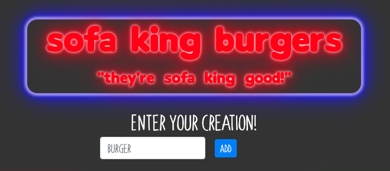
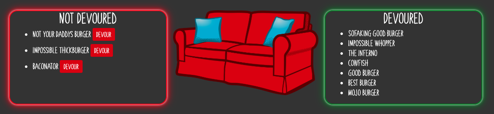

# Sofa-King-Burgers

This is a full stack application that utilizes Node JS, Express and Handlebars along with MySQL to create a virtual burger bar where a user can "consume" a burger on the menu or create their own. Once a burger has been consumed it is moved into the "devoured" section and can't be eaten again. This app makes use of GET, POST and PUT requests to recieve, send and update data for the user (CRUD method).

## Getting Started

To view the live app just follow this link: [Sofa King Burgers](https://pure-fortress-56859.herokuapp.com/)

* Add burgers to your menu using the input field.
* To eat a burger, click "devour".
* Once a burger has been devoured, it is removed from the menu.
    * Page load = GET
    * Adding burger = POST
    * Eating burger = PUT

## Challenges

A few challenges that I faced and solved when creating this application were:
* Properly configuring the MVC design pattern.
    * Setting up the server to talk with all of the different components of the app. (i.e. controller, orm, frontend js)
* Serving the data to the page with handlebars.
* Properly deploying the app and database to Heroku.

## Built With

* JavaScript
* Node JS
* MySQL
* Jaws DB
* Express
* Handlebars

## Authors

* Charlie Slone - [GitHub](https://github.com/ctslone) - [LinkedIn](https://www.linkedin.com/in/charlie-slone-704311a9/)